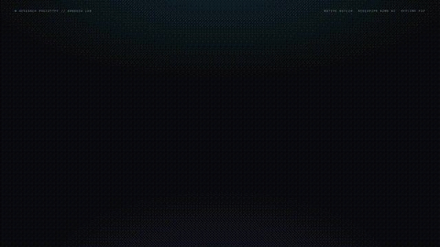

<div align="center">

# ✋ Air Transfer (AirXfer) V2
### *System-Wide Touchless Spatial Screen Transfer for Android*

**Grab. Move. Release.**

[](https://opensource.org/licenses/Apache-2.0)
[-3DDC84.svg?style=for-the-badge&logo=android&logoColor=white)](https://developer.android.com)
[](https://kotlinlang.org)
[](https://developers.google.com/mediapipe)
[](https://developers.google.com/nearby/connections/overview)

<br/>



<p align="center">
  <em>Watch the full product announcement film: <a href="assets/air_transfer_announcement.mp4"><b>assets/air_transfer_announcement.mp4</b></a></em>
</p>

</div>

---

## 🚀 What's New in Version 2 (V2)

**Air Transfer V2 is a major architectural evolution.** While V1 demonstrated in-app file sharing, **V2 transforms Air Transfer into a system-wide touchless interaction system inspired by Huawei-style air gestures.**

You no longer need to keep the app open or manually pick files:
1. **Enable Air Gestures once** inside Air Transfer.
2. **Switch to ANY app** on your phone (Chrome, Instagram, YouTube, WhatsApp, Settings, Home Screen, Gallery, etc.).
3. **Grab the current screen** by showing your palm and closing your fist in front of the front camera.
4. **Move your closed fist** towards a nearby device.
5. **Open your fist** at the receiving phone to catch and display the screenshot full-screen, saving it directly into the system Gallery!

---

## 🖐️ The V2 Interaction Model

```
SENDER DEVICE (Device A):
┌──────────────┐     ┌──────────────┐     ┌────────────────────────┐
│  🖐️ Open Palm│ ──> │ ✊ Close Fist │ ──> │ 🎴 Screen Grabs & Docks│
│  Arms Sensor │     │ Grabs Screen │     │ Soft Cyan Glowing Card │
└──────────────┘     └──────────────┘     └────────────────────────┘
                                                       │
                                              [ Move Hand with Fist ✊ ]
                                                       │
RECEIVER DEVICE (Device B):                            ▼
┌───────────────────────────────┐     ┌──────────────┐     ┌───────────────────────┐
│ 📥 Incoming Transfer Detected  │ ──> │ 🖐️ Open Palm │ ──> │ ✨ Full-Screen Arrival │
│ Receiver Locked (No Self-Grab)│     │ Catch Screen │     │ Saved to Gallery      │
└───────────────────────────────┘     └──────────────┘     └───────────────────────┘
```

### Clean Abort on Same Device
If you grab the screen on Device A and decide not to transfer, simply open your hand back in front of Device A. The card smoothly fades away without crashing or disrupting your current application.

---

## 🛠️ V2 Architecture & Under-the-Hood Innovations

```
┌─────────────────────────────────────────────────────────────────────────┐
│                         System-Wide Interaction                         │
│   • Home Screen • Chrome • Instagram • YouTube • Camera • Settings      │
└────────────────────────────────────┬────────────────────────────────────┘
                                     │
                 ┌───────────────────┴───────────────────┐
                 ▼                                       ▼
┌─────────────────────────────────┐     ┌─────────────────────────────────┐
│       AirGestureService         │     │     ScreenCaptureController     │
│ • Foreground Service (Camera)   │     │ • MediaProjection Hardware Pipe │
│ • Non-intrusive lifecycle       │     │ • Zero-latency ImageReader      │
│ • Quick Settings / Notif Kill   │     │ • Bounded 2-frame memory buffer │
└────────────────┬────────────────┘     └────────────────┬────────────────┘
                 ▼                                       ▼
┌─────────────────────────────────┐     ┌─────────────────────────────────┐
│   MediaPipe Vision Perception   │     │      AirObject Pipeline         │
│ • CameraX front sensor stream   │     │ • JPEG compressed byte payload  │
│ • 21 3D hand landmarks          │     │ • SHA-256 integrity checksum    │
│ • V2GestureClassifier           │     │ • Pre-buffered P2P stream       │
└────────────────┬────────────────┘     └────────────────┬────────────────┘
                 ▼                                       ▼
┌─────────────────────────────────┐     ┌─────────────────────────────────┐
│  TemporalGestureStateMachine    │     │   NearbyPresence & Transport    │
│ • Receiver state locking        │     │ • Strategy.P2P_CLUSTER mesh     │
│ • Anti-false-grab filter        │     │ • Lexicographical tie-breaker   │
│ • Fist orientation tolerance    │     │ • Active 1.5s grab beaconing    │
└────────────────┬────────────────┘     │ • TYPE_REQUEST_TRANSFER pull    │
                 ▼                      └────────────────┬────────────────┘
┌─────────────────────────────────┐                      │
│       SpatialOverlayView        │                      ▼
│ • Docked glowing preview card   │     ┌─────────────────────────────────┐
│ • Dynamic HUD status pill       │     │  MediaStore & Public Gallery    │
│ • Emerald arrival transition    │     │ • Pictures/Screenshots auto-save│
└─────────────────────────────────┘     └─────────────────────────────────┘
```

### 1. Robust P2P Mesh (`Strategy.P2P_CLUSTER`)
- Upgraded Google Nearby Connections from Point-to-Point to **`Strategy.P2P_CLUSTER`**, enabling symmetric advertising and discovery between phones without master/client role conflicts.
- **Initiator Tie-Breaking**: When Device A and Device B discover each other simultaneously, only the lexicographically greater endpoint initiates the connection, preventing double-request collisions.
- **Active Beaconing & Late-Join Sync**: While holding a grabbed screen, Device A broadcasts `TYPE_AIR_GRABBED` every 1.5 seconds. Newly connected peers instantly receive the pre-buffered screenshot bytes.
- **Bidirectional Catch (`TYPE_REQUEST_TRANSFER`)**: If the receiver triggers a catch gesture before image bytes arrive over the air, it requests the screenshot immediately, ensuring zero failed handshakes.

### 2. Receiver State Locking (Preventing False Self-Grabs)
- In V2, when Device B receives a peer grab notice, its internal gesture engine transitions into `RECEIVER_EXPECTING`.
- In this mode, Device B **completely ignores open palms for grabbing**, ensuring that approaching the phone with a hand will never accidentally grab Device B's own screen.
- Device B strictly awaits the approaching closed fist ✊ (`RECEIVER_FIST_DETECTED`) and subsequent release 🖐️ (`CatchTriggered`).

### 3. Native MediaStore Public Storage
- Received screenshots are immediately saved to `Pictures/Screenshots` using Android's `MediaStore` and scanned via `MediaScannerConnection`.
- Transferred screenshots instantly appear in the native **Gallery**, **Google Photos**, and **Files** apps.

### 4. Preserved Legacy V1 In-App Mode
- The original in-app multi-file transfer system (with custom radar canvas and file picker) remains intact and accessible via the **"Switch to Legacy In-App Mode (V1)"** button at the bottom of the home screen.

---

## 📲 Getting Started

### Download Prebuilt APK
Download the latest V2 APK directly from GitHub Releases:
- [**📥 Download AirTransfer-v2.0.0-preview.apk**](https://github.com/Hackerop777/Air-Transfer/releases/download/v2.0.0-preview/AirTransfer-v2.0.0-preview.apk)
- Legacy V1 release: [AirTransfer-v1.0.0-preview.apk](https://github.com/Hackerop777/Air-Transfer/releases/download/v1.0.0-preview/AirTransfer-v1.0.0-preview.apk)

### First-Time Setup on Both Devices
1. Install and launch **Air Transfer** on both phones.
2. Grant the required permissions:
   - **Camera Access** (for on-device hand gesture detection)
   - **Display Over Other Apps** (for the floating card and status pill)
   - **Nearby Wi-Fi / Bluetooth** (for high-speed local P2P transfer)
   - **Screen Capture** (granted when toggling Air Gestures ON)
3. Both devices will automatically discover each other in the background (`🟢 Ready with [Device Name]`).
4. Exit to your home screen or open any app—Air Gestures are active system-wide!

---

## 🔨 Building from Source

```bash
# Clone the repository
git clone https://github.com/Hackerop777/Air-Transfer.git
cd Air-Transfer

# Run unit tests
./gradlew testDebugUnitTest

# Assemble debug APK
./gradlew assembleDebug

# Install to connected device
./gradlew installDebug
```

---

## 📄 License

```text
Copyright 2026 Air Transfer Contributors

Licensed under the Apache License, Version 2.0 (the "License");
you may not use this file except in compliance with the License.
You may obtain a copy of the License at

    http://www.apache.org/licenses/LICENSE-2.0

Unless required by applicable law or agreed to in writing, software
distributed under the License is distributed on an "AS IS" BASIS,
WITHOUT WARRANTIES OR CONDITIONS OF ANY KIND, either express or implied.
See the License for the specific language governing permissions and
limitations under the License.
```